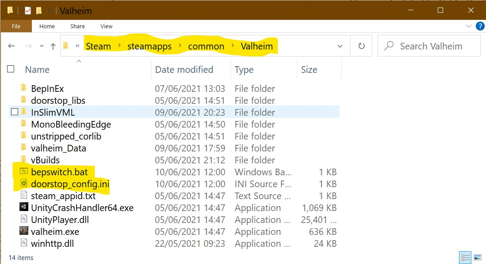
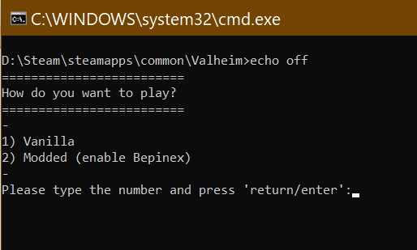

# Bepswitch Readme

**2.0** ***New Plug and play version!***  

## What is Bepswitch?

This is a batch (.bat) file that switches Bepinex on and off so you can play either vanilla or modded easily. It is useful if you are in a couple of different servers - some with mods and some that don't allow mods.  

## How do I install it?

Download the mod and put bepswitch.bat in your Valheim folder.  
Depending on your install, this should look like:

                D:\Steam\steamapps\common\Valheim

The contents of your folder should look something like this:

## How do I use it?

Just double click on `bepswitch.bat` and you're good to go :)

*I suggest creating a shortcut of the file and putting it in a more easy to find location.*

## What does it do?

This new version works by editing the text inside the `doorstop_config.ini` file.
It switches between `enabled=true` and `enabled=false` to enable/disable Bepinex from loading.  
Yes, you can just do this manually by editing the text in `doorstop_config.ini` each time.

## Why did I make it?

I made this because I prefer to manage mods manually rather than using a manager, and did not want to have to edit files each time I wanted to play vanilla (I'm lazy).  

I also like learning new code-ish stuff, and figuring this out was fun :)

# Credits

The idea for this was from here:
https://steamcommunity.com/app/892970/discussions/0/3069740625181087689/?l=portuguese

Sample code for first iteration was from here:
https://stackoverflow.com/questions/4051294/how-to-overwrite-existing-files-in-batch

Thanks to LuxZg on Nexus who pointed me to here: https://stackoverflow.com/questions/60034/how-can-you-find-and-replace-text-in-a-file-using-the-windows-command-line-envir

LuxZg also explained to me about replacing strings, so if you like this version 2.0, maybe give them a kudos too :)
